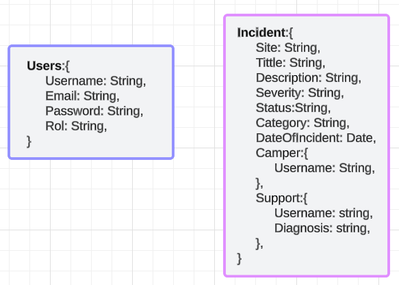

# CampusLands Incidets

CampusLands Incidents is a web application that enables campers to create new incident reports for incidents that occur on campus. It also provides trainers with the ability to view and edit these reports, while support staff can perform diagnostics and mark incidents as resolved.

## Features

- Camper View: Campers can log in and create incident reports, providing essential details about the incident, such as location, description, and category.

- Trainer Viw: Trainers have access to a list where they can view and edit incident reports submitted by campers. They can provide additional information or updates.

- Support View: Support staff can access incident reports, perform diagnostic procedures, and mark incidents as resolved once they are completed.

- User Authentication: The application includes user authentication to ensure secure access for campers, trainers, and support staff.

## Technologies Used

- Frontend: Vite + React.js
- Backend: Node.js with Express.js
- Database: MongoDB
- Other technologies used: Tailwindcss

## Getting Started

### Prerequisites:

- [Node.js](https://nodejs.org/) (v18.17.1)

### Installation

1. CLone the repository: `https://github.com/AoKuangg/Filtro-Incidencias-React.git`
2. Navigate to the project directory: `cd Filtro-Incidencias-React`
3. Install dependencies: `npm i`
4. Manage your environment variables:
```json
    VITE_SERVER={"hostname":"", "port":}
    VITE_ATLAS_CONNECTION={"user":"","password":"","database":""}
    VITE_JWT_KEY={""}
    VITE_HOSTNAME=""
```
5. Start the server: `npm run start`
6. Start the frontend: `npm run dev`

## Data Base
Imagen of the data base:



## Usage

To get started with the CampusLands Incidents, follow these steps:

1. **Registration**: When you first visit the website, you'll find a navigation bar with two buttons: "Login" and "Register." Since you're new to the platform, click on "Register" to create your account. During registration, you'll be prompted to select your role (Camper, Trainer, or Support).

2. **Camper Role**:
   - If you choose the "Camper" role, you'll be directed to a form where you can register new incidents. Provide essential details about the incident, including its location, description, and category.

3. **Trainer Role**:
   - If you select the "Trainer" role, you'll access a dashboard displaying a list of incident reports submitted by campers. From here, you can view and modify incident details, as well as assign incidents to support staff for resolution. The dashboard also includes filters for easy incident management.

4. **Support Role**:
   - Opting for the "Support" role will take you to a list of incidents assigned to you. Here, you can mark incidents as resolved and attach a diagnosis for each one.

Enjoy using the CampusLands Incidents, and feel free to explore the different features based on your role!


## Notion
[Incidents](https://www.notion.so/Incidences-e840756678aa43f6be351ee573ec0ed7?pvs=4)

## License

This project is licensed under the MIT License - see the [LICENSE](LICENSE) file for more details.

## Author
[Camilo Paez](https://github.com/AoKuangg)